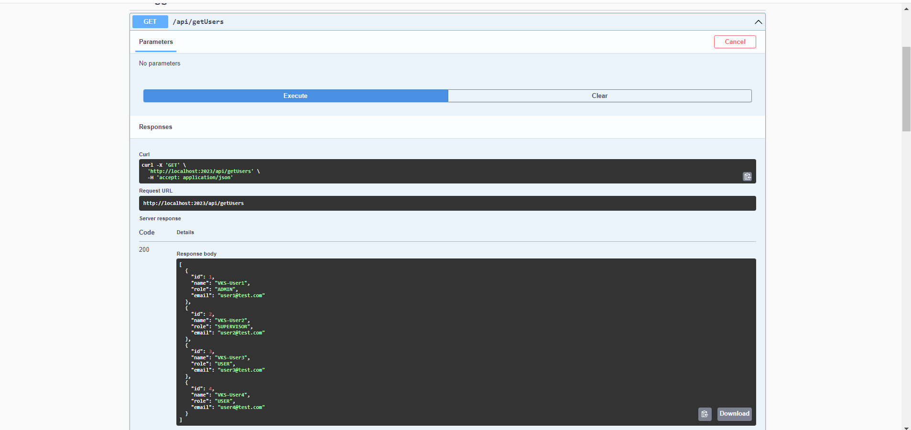
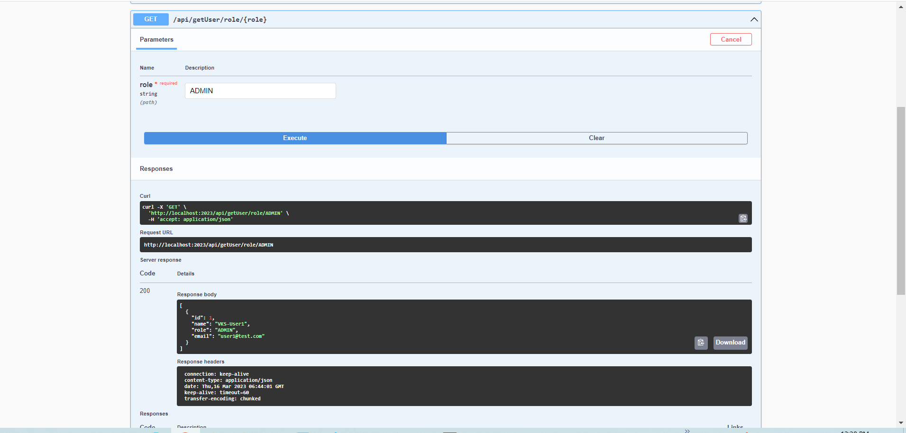
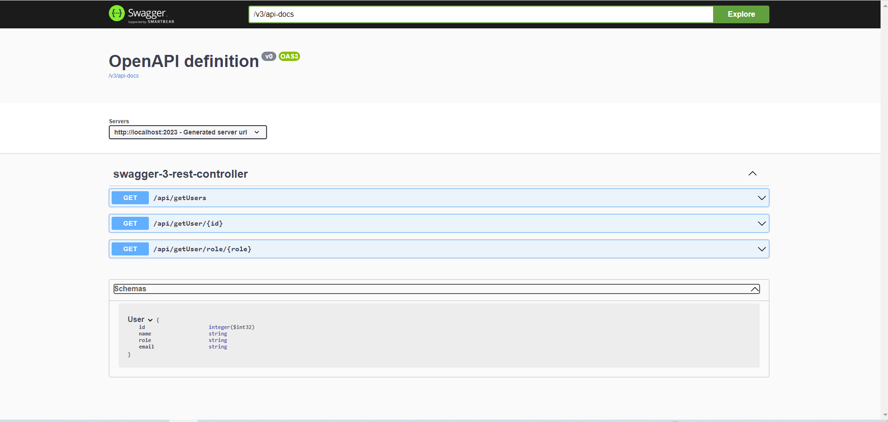

### Examples

# Spring Boot Swagger 3 Example | VKS

## URLS
http://localhost:2023/swagger-ui.html

http://localhost:2023/v3/api-docs/

## Run Spring Boot application
```
mvn spring-boot:run
```
## Test Spring Boot Swagger 3 Example
<ol>
<li>Open http://localhost:2023/swagger-ui.html in browser to view the Swagger UI documentation. </li>
<li>We can see all rest points and can execute to get the response.</li>
</ol>




